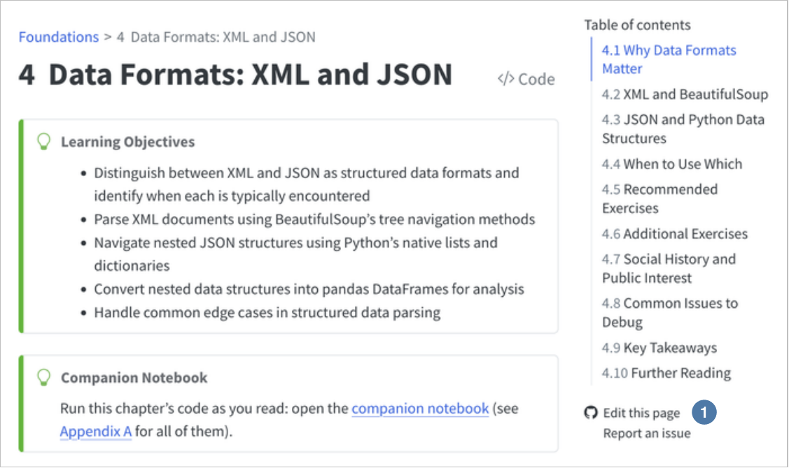
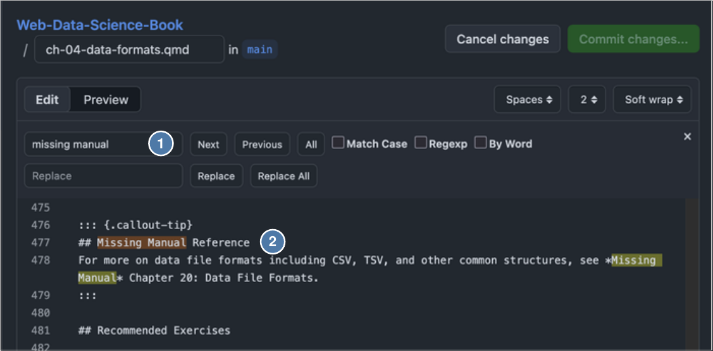
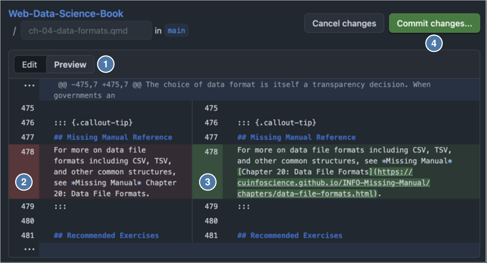
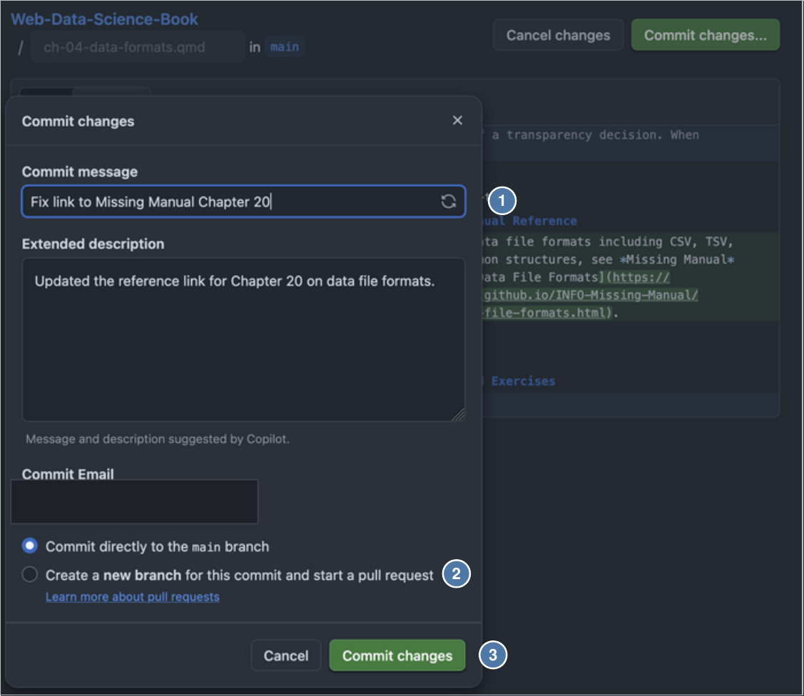

# Issue to pull request

*Week 7 Friday activity · hard · about 30 minutes — INFO 4617 Web Data Science*

You fix the problem that an issue describes, in GitHub's web editor. Then you
open a pull request that closes the issue when it merges. You do all of it in
the browser: you need no terminal and no copy of the book on your laptop.

Your chapter's board in week 7's slides lists issues that have no pull
request. Start with one that a triage comment calls **small**.

| Activity | Difficulty | Handout |
|---|---|---|
| Triage an issue | easy | [`triage-an-issue.md`](triage-an-issue.md) |
| Review a pull request | medium | [`review-a-pull-request.md`](review-a-pull-request.md) |
| **Issue to pull request** | hard | this page |

Work in pairs. One partner works in the browser, and the other reads this
page aloud.

---

## 1 · Claim the issue

1. Sign in to GitHub.
2. Open the issue
   (`https://github.com/cuinfoscience/Web-Data-Science-Book/issues/` and its
   number). Read it, and read its comments.
3. Write the comment `I'm taking this.` and click **Comment**. Then no other
   pair starts the same fix.

## 2 · Open the chapter in the editor

1. Open the book at the chapter:
   <https://cuinfoscience.github.io/Web-Data-Science-Book/>
2. Click **Edit this page** (1), at the bottom of the right-hand sidebar.
   GitHub opens the chapter's source file, `ch-NN-name.qmd`.

   

3. Click the pencil icon, **Edit this file**. If GitHub asks you to
   **fork** the repository, accept. A fork is your own copy of the book,
   and GitHub makes it for you. The steps after this are the same.

## 3 · Make one change

1. Click in the editor and press <kbd>Ctrl</kbd>+<kbd>F</kbd>
   (<kbd>Cmd</kbd>+<kbd>F</kbd> on a Mac). This opens the editor's own search
   bar (1). Your browser's search cannot see the whole file. Search for words
   from the section, such as its heading (2).

   

2. Make the change that the issue asks for. Change nothing else.
3. Keep the Markdown correct:
   - put an empty line above a heading (`##`) or a callout (`:::`);
   - write a link as `[text](https://...)`, with no space between `]` and
     `(`.
4. Click **Preview** (1). Compare the old line (2) with the new line (3).
   Then click **Commit changes…** (4).

   

## 4 · Commit to a new branch

1. In **Commit message** (1), say what you changed and where, for example
   `Ch. 5: say where requests stores redirect hops`.
2. Select **Create a new branch for this commit and start a pull request**
   (2). The dialog selects *Commit directly to the main branch* first:
   change it. `main` refuses direct commits.
3. Click the green button (3). When a new branch is selected, the button
   says **Propose changes**.

   

In a fork, GitHub makes the branch for you, and the button says
**Propose changes**.

## 5 · Open the pull request

1. GitHub shows **Comparing changes**: your branch and `main`, with the
   difference between them. Make sure that only your change shows. Click
   **Create pull request**.
2. Write a title that says what and where. Do not write
   `Update ch-05-protocols.qmd`. Write
   `Ch. 5: say where requests stores redirect hops`.
3. The description starts with the book's template. Replace each
   `[bracketed hint]`:
   - `Closes #N`: the issue's number, for example `Closes #175`. GitHub
     closes the issue when the pull request merges.
   - **Location**, **Problem**, **Why**, and **Change**: the file and the
     heading, what was wrong, who it affects, and what you changed.
   - **AI assistance**: `none`, or the tool and what it did.
   - **Checks**: tick the first box. After the second box, write
     `Edited in the browser, so notebooks not regenerated.` Tick the third
     box when the Render check is green.
4. Click **Create pull request**.

<!-- Screenshot to add: img/pr-template.png (see img/IMAGES.md) -->

## 6 · After you open it

| You see | Do this |
|---|---|
| **Render** with a red ✗ | Click **Details**. Find the first `ERROR` line. A broken cross-reference (`@sec-...`) or a code block that does not close is the usual cause. Fix it on the same branch, as in the next row. |
| A review that asks for changes | Open your pull request, and click **Files changed**. Click the file's **⋯** menu, then **Edit file**. Make the change, and commit it to the same branch. Do not open a new pull request. |
| **Notebook sync** with a red ✗ | Normal for a change made in the browser. I regenerate the notebooks after I merge. |
| *This branch has conflicts that must be resolved* | Leave it. I resolve conflicts. |

<!-- Screenshot to add: img/pr-edit-file.png (see img/IMAGES.md) -->

---

## Do not

- **Do not click Merge pull request.** I merge after class.
- **Do not change a file in `notebooks/` or `images/`.** A script makes the
  notebooks from the chapters, and it overwrites a direct change.
- **Do not put two fixes in one pull request.** Two fixes are two pull
  requests.

## Next

Ask a pair in your chapter to [review your pull request](review-a-pull-request.md),
and review theirs.
